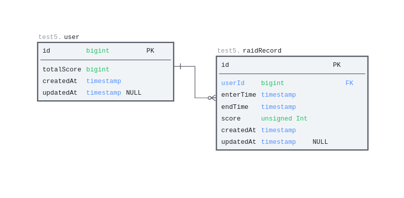
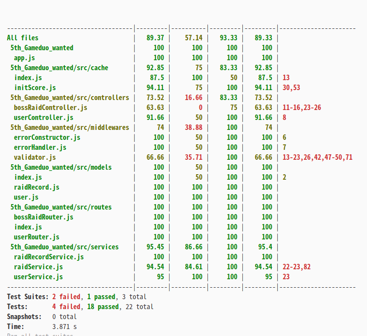

<a name="readme-top"></a>
<!-- PROJECT LOGO -->
<br />
<div align="center">
  <h3 align="center">원티드 프리온보딩 5차 과제</h3>
  </br>
  <p align="center">
  서버 캐시를 사용한 보스레이드 PVE 컨텐츠 만들기
    <br />
    <!-- <a href="https://github.com/othneildrew/Best-README-Template"><strong>API 문서 보러가기 »</strong></a> -->
    <br />
  </p>
</div>

<!-- ABOUT THE PROJECT -->
## 프로젝트 소개
개발 기간   
2022.12.19 ~ 2022.12.27   
- *redis npm 라이브러리 다운 버전 사용해서 재구현*

2022.11.12 ~ 2022.11.18         
- *redis-npm 이슈로 다른 Server cache 라이브러리를 사용해서 임시로 구현*

프로젝트 요구 사항   
#### 간단한 보스레이드 프로그래밍 
  - 레이드 : 유저 1명이 보스룸에 접속할 때 하는 게임 한번을 가리킴 
  - 유저는 자신의 유저 id를 발급 받을 수 있다. 
  - 유저는 보스룸에 유저가 없다면 보스룸에 들어갈 수 있다.    
  - 만약, 어떤 유저가 레이드가 진행중이라면 다른 유저는 레이드를 할 수 없다.
  - 레이드는 180초 제한시간을 가진다.
  - 보스룸에 입장한 유저가 자신의 회원 id와 진행중인 보스레이드 id를 성공적으로 입력하면 레이드가 종료되고 점수를 얻는다.
  - 유저는 실시간으로 내림차순으로 랭킹 조회가 가능하다.
  - 유저 id로 유저의 보스 레이드 기록을 열람할 수 있다.
  - S3로 URL 저장된 레이드레벨과 레벨별 점수를 반영한다. 
 
배운 것:
* 캐시 라이브러리 이용한 구현(개발)
* 서버 캐시 구현 방법
* unit Test
<p align="right">(<a href="#readme-top">back to top</a>)</p>

### 개발 환경
개발 환경 

운영체제: ubuntu 22.04     
IDE : Windows VScode

개발 언어, 라이브러리  
`Javascript`   
`Express(Node.js)`      
`lru-cache` (redis 대체), // *redis npm [라이브러리 작동오류 이슈](https://stackoverflow.com/questions/70145795/node-redis-does-not-work-on-my-windows-computer-even-though-the-server-is-up-and)로 대체해서 사용*  
`sequelize`   
`jest`

### 컨벤션 
javascript : [Airbnb ](https://github.com/airbnb/javascript)  
commit : [git commit 메시지 컨벤션](https://www.conventionalcommits.org/en/v1.0.0/)   

파일 구조
```.
├── README.md
├── app.js
├── package-lock.json
├── package.json
├── server.js
├── src
│   ├── cache
│   ├── config
│   │   └── config.json 
│   ├── controllers
│   ├── middlewares
│   ├── migrations
│   ├── models
│   ├── routes
│   ├── seeders
│   ├── services
│   └── tests
└── .env
```
<p align="right">(<a href="#readme-top">back to top</a>)</p>

### 프로젝트 구동 방법

1. 레포지토리 다운받기
    ```sh
    git clone https://github.com/OolongTea620/5th_wanted_Gameduo.git
    ```
2. server.js가 있는 디렉토리로 이동
    ```sh
    cd [폴더명] // cd 5th_wanted_Gameduo
    ```
3. npm 패키지 설치
   ```sh
   npm install
   ```

4. 서버 실행
   ```js
   npm test // 테스트 실행
   npm dev // 개발 모드 실행
   npm start // 서버 프로그램 실행
   ```

  환경 변수   
  1. dotenv
  ```dotenv
# Server
MODE_ENV=[development|production]중 1
PORT=포트번호

# redis
REDIS_USERNAME=유저명
REDIS_PASSWORD=비번
REDIS_HOST=접근호스트
REDIS_PORT=서비스 리스닝 포트

# S3 url
BOSSRAID_INFO_URL=과제 json데이터 S3 주소
  ```

 2. /config/config.json
   ```json
   {
  "development": {
    "username": "유저명",
    "password": "비밀번호",
    "database": "스키마명(데이터베이스명)",
    "host": "(연결 포트)",
    "dialect": "mysql"
  },
  "test": {
    ... development와 스키마명 제외 동일
  },
  "production": {
    ...(생략)
  }
}
   ```    

<p align="right">(<a href="#readme-top">back to top</a>)</p>

<!-- GETTING STARTED -->
## 개발 과정
**구현 기능 명세**  

[API기능명세 URL](https://docs.google.com/spreadsheets/d/1SkjyH8MstoKRNQVduIeXUZnzSRG-P8zjsFJtw92Tq74/edit?usp=sharing)


**데이터베이스 설계**   

ERD



**redis cache**  
| keyName  | 데이터 타입 |                       설명                       |      비고      |
| :------- | :---------: | :----------------------------------------------: | :------------: |
| rank     | sorted sets | 서버 구동 이후, 유저가 획득한 보스레이드 총 점수 | ranking조회 용 |
| bossRaid |   hashes    |          현재 진행중인 레이드 진행 정보          |   180초 제한   |


**개발 리스트**

API
- [x] 유저 생성 API  
- [x] 보스룸 레이드 상태 확인 API
- [x] 보스룸 입장(레이드 시작)
- [x] 점수 얻기 (유저 id, 레이드 id 입력 성공 시 점수 얻음)API
- [x] 현재 총 랭킹 조회 API
- [x] 특정 유저 레이드 히스토리 조회 API

그 외
- [x] S3 url을 이용해서 레이드 점수표 정보 로드 하기

### 테스트
- [ ] 유닛테스트 
  - [x] Services 테스트
  - [ ] Validator 테스트
- [ ] 통합테스트 (75%)

**테스트 커버리지 상황** 
- validator 유닛테스트 미완료 -> 많이 사용되는 모듈인 만큼 몰려 있음
- superTest 75% 정도 완료


<p align="right">(<a href="#readme-top">back to top</a>)</p>

<!-- ROADMAP -->
## 추가 개발 체크 리스트

- [x] API 구현
- [x] README.md 작성
- [ ] Test 작성
  - [x] unitTest
  - [ ] superTest (75% 완료)
- [x] Redis-npm으로 다시 구현(리펙토링)
- [x] Validator 도입 (Joi)
- [ ] swagger도입


<p align="right">(<a href="#readme-top">back to top</a>)</p>

## 개발 이슈
**redis-node 라이브러리 비구동 문제** :  
1. redis-node 버전을 4.x.x -> 3.x.x 한 단계 낮추어서 했지만 연결은 되어도 레디스에 데이터 입력이 되지 않았음.   
2. npm 라이브러리 검색으로 대체 모듈을 찾고 대체해서 개발 [git commit url]()
  ```text
  * lru-cache를 사용한 이유. 
  1. expire key와 동일한 기능이 있었음. 
  2. value 자료형이 redis보다 자유도가 높았음 (redis는 value 데이터타입에따라 cli 명령어가 달라진다.)
  3. 한글키워드 검색 시 선례가 있었음 
  ```
\> [commit : 7c8c893 + c99277e](https://github.com/OolongTea620/5th_wanted_Gameduo/commit/dcf37e91a0723d93cb5293fe0ec2e43fc7c7714c): 다시 redis-node로 다시 개발, main에 반영

  


<!-- MARKDOWN LINKS & IMAGES -->
<!-- https://www.markdownguide.org/basic-syntax/#reference-style-links -->
[contributors-shield]: https://img.shields.io/github/contributors/othneildrew/Best-README-Template.svg?style=for-the-badge
[contributors-url]: https://github.com/othneildrew/Best-README-Template/graphs/contributors
[forks-shield]: https://img.shields.io/github/forks/othneildrew/Best-README-Template.svg?style=for-the-badge
[forks-url]: https://github.com/othneildrew/Best-README-Template/network/members
[stars-shield]: https://img.shields.io/github/stars/othneildrew/Best-README-Template.svg?style=for-the-badge
[stars-url]: https://github.com/othneildrew/Best-README-Template/stargazers
[issues-shield]: https://img.shields.io/github/issues/othneildrew/Best-README-Template.svg?style=for-the-badge
[issues-url]: https://github.com/othneildrew/Best-README-Template/issues
[license-shield]: https://img.shields.io/github/license/othneildrew/Best-README-Template.svg?style=for-the-badge
[license-url]: https://github.com/othneildrew/Best-README-Template/blob/master/LICENSE.txt
[linkedin-shield]: https://img.shields.io/badge/-LinkedIn-black.svg?style=for-the-badge&logo=linkedin&colorB=555
[linkedin-url]: https://linkedin.com/in/othneildrew
[product-screenshot]: images/screenshot.png
[Next.js]: https://img.shields.io/badge/next.js-000000?style=for-the-badge&logo=nextdotjs&logoColor=white
[Next-url]: https://nextjs.org/
[React.js]: https://img.shields.io/badge/React-20232A?style=for-the-badge&logo=react&logoColor=61DAFB
[React-url]: https://reactjs.org/
[Vue.js]: https://img.shields.io/badge/Vue.js-35495E?style=for-the-badge&logo=vuedotjs&logoColor=4FC08D
[Vue-url]: https://vuejs.org/
[Angular.io]: https://img.shields.io/badge/Angular-DD0031?style=for-the-badge&logo=angular&logoColor=white
[Angular-url]: https://angular.io/
[Svelte.dev]: https://img.shields.io/badge/Svelte-4A4A55?style=for-the-badge&logo=svelte&logoColor=FF3E00
[Svelte-url]: https://svelte.dev/
[Laravel.com]: https://img.shields.io/badge/Laravel-FF2D20?style=for-the-badge&logo=laravel&logoColor=white
[Laravel-url]: https://laravel.com
[Bootstrap.com]: https://img.shields.io/badge/Bootstrap-563D7C?style=for-the-badge&logo=bootstrap&logoColor=white
[Bootstrap-url]: https://getbootstrap.com
[JQuery.com]: https://img.shields.io/badge/jQuery-0769AD?style=for-the-badge&logo=jquery&logoColor=white
[JQuery-url]: https://jquery.com 